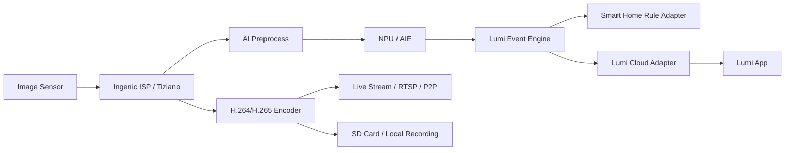
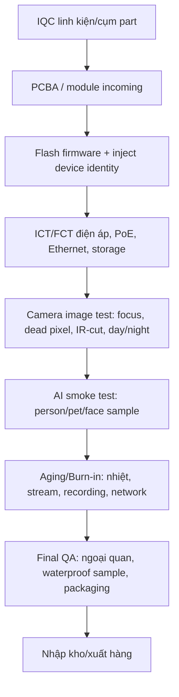

# Lumi Cam AI - Project Info Detail Gửi Ingenic

Phiên bản: `v0.1`  
Ngày: `2026-07-07`  
Đơn vị đề xuất: Lumi Việt Nam  
Đối tác cần hỗ trợ: Ingenic và hệ sinh thái đối tác phần cứng/ODM tại Trung Quốc  
Mục tiêu tài liệu: giúp Ingenic hiểu đúng mục tiêu sản phẩm, phạm vi hỗ trợ, ràng buộc kỹ thuật, ràng buộc chi phí và timeline để rút ngắn thời gian phát triển camera AI của Lumi.

## 1. Tóm Tắt Điều Hành

Lumi đã có nền tảng Cloud và Apps trong hệ sinh thái nhà thông minh. Dự án này hướng tới phát triển một dòng camera AI dùng nền tảng chip Ingenic, trước mắt tập trung thị trường Việt Nam, sau đó mở rộng sang các bài toán nhà thông minh, tòa nhà, trường học, bệnh viện, đô thị và khu công cộng.

Lumi mong muốn làm chủ các phần có giá trị lõi:

- Firmware.
- AI module chạy tại biên.
- Tích hợp Cloud và Apps Lumi.
- Lắp ráp hoàn thiện sản phẩm tại nhà máy Lumi.
- Quy trình test, kiểm soát chất lượng và sản xuất hàng loạt.

Ingenic được kỳ vọng hỗ trợ:

- Cung cấp hoặc giới thiệu đối tác cung cấp đầy đủ linh kiện/cụm linh kiện cần thiết.
- Cung cấp BSP/SDK/toolchain để Lumi có thể tự build, phát triển và bảo trì firmware.
- Hỗ trợ khả năng phát triển firmware bằng Rust language hoặc ít nhất hỗ trợ kiến trúc cho phép Lumi viết module Rust an toàn trên nền Linux/BSP hiện có.
- Cung cấp AI SDK, model mẫu, quy trình convert/quantize/benchmark/deploy model trên NPU.
- Cung cấp quy trình, công cụ và phương pháp kiểm soát chất lượng sản xuất hàng loạt.

## 2. Bối Cảnh Kinh Doanh Và Sản Phẩm

### 2.1 Mục Tiêu Kinh Doanh

| Hạng mục | Mục tiêu |
|---|---|
| Thị trường giai đoạn 1 | Việt Nam |
| Sản lượng năm đầu | Tổng `25.000-50.000 pcs` |
| Timeline phát triển | `6-7 tháng` từ khi chốt platform/partner/scope |
| BOM mục tiêu | Khoảng `25 USD` tổng BOM cho cấu hình camera phổ thông |
| Năng lực Lumi muốn làm chủ | Firmware, AI, Cloud/App integration, assembly, factory test, quality control |
| Mô hình supply chain | Lumi mua part/cụm part từ đối tác Trung Quốc do Ingenic giới thiệu, sau đó lắp ráp/test tại nhà máy Lumi |

### 2.2 Tư Duy Sản Phẩm

Camera không chỉ là thiết bị ghi hình. Camera phải trở thành cảm biến AI quan trọng trong hệ sinh thái Lumi:

- Nhận biết người, thú cưng, phương tiện, sự kiện bất thường.
- Tạo sự kiện chính xác cho automation nhà thông minh.
- Giảm cảnh báo sai so với camera chuyển động thông thường.
- Cho phép người dùng xem lịch sử theo sự kiện, thay vì tua video thủ công.
- Tạo nền tảng mở rộng sang building/school/hospital/city/public-area solutions.

## 3. Danh Mục Sản Phẩm Dự Kiến

Lumi cần phát triển 4 mẫu sản phẩm dựa trên một nền tảng chung tối đa có thể.

| Mã tạm | Loại sản phẩm | Vai trò | Ghi chú |
|---|---|---|---|
| LC-O-Bullet | Outdoor Bullet Camera | Camera ngoài trời phổ thông, dễ lắp, phù hợp cổng/sân/tường rào | Bắt buộc PoE, SD card optional |
| LC-O-Dome | Outdoor Dome Camera | Camera ngoài trời/thương mại, thẩm mỹ, khó xoay phá hướng hơn bullet | Bắt buộc PoE, SD card optional |
| LC-O-Turret | Outdoor Turret Camera | Cân bằng giữa thẩm mỹ, góc nhìn và lắp đặt dân dụng/công trình | Bắt buộc PoE, SD card optional |
| LC-I-Compact | Indoor Compact Camera | Camera trong nhà nhỏ gọn, riêng tư, tối ưu nhận diện người/face/pet | PoE cần xác nhận theo thiết kế cơ khí và trải nghiệm lắp đặt |

### 3.1 Yêu Cầu Chung Cho 4 Mẫu

| Nhóm yêu cầu | Định hướng |
|---|---|
| Kết nối chính | Bắt buộc có Ethernet/PoE cho các mẫu outdoor |
| 4G/LTE | Không cần |
| Pin/solar | Không cần |
| Lưu trữ cục bộ | microSD card là option |
| Độ phân giải mục tiêu | 2K là baseline; 4K cần xác nhận lại SoC phù hợp |
| AI tại biên | Người, face, vật nuôi, vật thể/sự kiện cơ bản; smoke/fire cần benchmark thực tế |
| Cloud/App | Lumi tự làm, Ingenic không cần tích hợp Cloud/App |
| Lắp ráp và test | Tại nhà máy Lumi |

## 4. Quyết Định Platform: T33, 2K/5MP Và Rủi Ro 4K

### 4.1 Thông Tin Công Khai Cần Dùng Làm Cơ Sở Trao Đổi

Theo trang sản phẩm chính thức của Ingenic:

- T33 hỗ trợ `5MP 30fps`, độ phân giải `2880x1620`, ISP Tiziano V4.1, video encoder Hera-V1.6.
- T33 được công bố có AI Engine `0.5TOPS@INT8`, không phải 1TOPS theo thông tin công khai.
- T33 hỗ trợ H.264/H.265/JPEG, hiệu năng mã hóa tối đa được công bố gồm `2880x1620@30fps` và `3200x1800@25fps`.
- T33 có Ethernet MAC RMII, SDIO, eMMC/SD, secure boot và security engine.

Từ đó, cần đặt câu hỏi rõ với Ingenic:

1. T33 có biến thể nào đạt `1TOPS@INT8` không?
2. Nếu Lumi muốn 4K thật `3840x2160`, Ingenic khuyến nghị dùng T40/T41 hay một platform khác?
3. Nếu vẫn dùng T33, nên định vị sản phẩm là 2K/5MP thay vì 4K để tránh rủi ro performance, nhiệt, cost và timeline.

### 4.2 Khuyến Nghị Platform Theo SKU

| SKU | Khuyến nghị ban đầu | Lý do |
|---|---|---|
| Outdoor Bullet | T33 cho bản 2K/5MP cost-down; T40/T41 nếu bắt buộc 4K | Bullet có thể là volume SKU, cần BOM thấp |
| Outdoor Dome | T33 cho 2K/5MP; cân nhắc T40/T41 nếu dùng cho công trình cần 4K | Dome thường cần hình ảnh ổn định, WDR/ISP tốt |
| Outdoor Turret | T33 cho 2K/5MP | Cân bằng chi phí và trải nghiệm |
| Indoor Compact | T33 hoặc SoC thấp hơn/tối ưu hơn nếu không cần 4K | Indoor cần nhỏ, mát, yên tĩnh, chi phí tốt |

### 4.3 Điểm Cần Chốt Với Ingenic

Nếu BOM tổng khoảng `25 USD`, cần Ingenic/partner đưa ra ít nhất 2 cấu hình:

- **Cost-down 2K/5MP Platform**: ưu tiên T33, PoE, SD optional, AI cơ bản ổn định.
- **Premium 4K Platform**: dùng T40/T41 hoặc platform tương đương, chấp nhận BOM cao hơn nếu cần.

## 5. Yêu Cầu Hardware Và Supply Chain

### 5.1 Phạm Vi Linh Kiện/Cụm Linh Kiện Cần Ingenic Giới Thiệu Đối Tác

Lumi mong muốn Ingenic giới thiệu đối tác có thể cung cấp hoặc phối hợp cung cấp trọn bộ thành phần:

| Nhóm | Thành phần cần có |
|---|---|
| Main board | SoC Ingenic, DDR/Flash, PMIC, Ethernet/PoE interface, audio, debug interface |
| Camera sensor | Sensor 2K/5MP hoặc 4K tùy SKU, lens phù hợp, IR-cut, FOV options |
| PoE | PoE PD module/chipset, isolation, surge protection, thermal design |
| Network | Ethernet PHY/MAC integration, RJ45, ESD/surge protection |
| Storage | microSD option, eMMC/SPI NAND/NOR theo cấu hình |
| Audio | Microphone, speaker option, audio codec nếu cần, AEC/ANR/AGC |
| Night vision | IR LED, warm light option, light sensor, IR-cut driver |
| Housing | Bullet/dome/turret/indoor compact mechanical kits |
| Waterproof | IP65/IP66 cho outdoor, gasket, screw, cable seal |
| Thermal | Heat spreader, thermal pad, enclosure heat path |
| Manufacturing fixture | Flash jig, test jig, aging rack, camera chart, PoE test fixture |

### 5.2 Yêu Cầu Cho Outdoor

| Hạng mục | Yêu cầu đề xuất |
|---|---|
| Chống nước/bụi | Tối thiểu IP65, ưu tiên IP66 nếu BOM cho phép |
| Chống sét lan truyền | Cần thiết vì dùng PoE ngoài trời |
| Nhiệt độ hoạt động | Cần xác nhận theo thị trường Việt Nam, đề xuất test nóng ẩm kéo dài |
| Hồng ngoại | Cần IR night vision ổn định; tùy SKU có thể thêm warm light |
| Lắp đặt | Dễ thi công cho đại lý Lumi, hạn chế thao tác căn chỉnh phức tạp |

## 6. Firmware, BSP Và Rust Development

### 6.1 Mục Tiêu Làm Chủ Firmware

Lumi không chỉ nhận firmware đóng gói. Lumi cần làm chủ:

- Build SDK/BSP từ source.
- Tùy biến kernel, driver, board config.
- Tùy biến boot, partition, OTA, factory reset.
- Tùy biến media pipeline: sensor -> ISP -> encoder -> stream/storage/AI.
- Tùy biến AI pipeline và event pipeline.
- Tích hợp với Cloud/App Lumi bằng module riêng.
- Debug/log/trace crash phục vụ field operation.

### 6.2 Rust Language Requirement

Lumi mong muốn phát triển firmware/app-layer bằng Rust để tăng độ an toàn và khả năng bảo trì.

Cần Ingenic xác nhận:

| Câu hỏi | Mục tiêu |
|---|---|
| BSP là Linux/OpenWrt/buildroot hay RTOS riêng? | Xác định mức khả thi của Rust |
| Toolchain có hỗ trợ cross-compile Rust không? | Build module Rust chính thức |
| Có dynamic/static linking constraint nào không? | Tránh lỗi ABI/library khi deploy |
| SDK media/AI API là C/C++? | Lumi sẽ viết Rust FFI wrapper |
| Có sample app tách module rõ không? | Rút ngắn thời gian dựng app architecture |
| Có Yocto/OpenWrt package flow không? | Chuẩn hóa CI/CD firmware |

### 6.3 Kiến Trúc Firmware Đề Xuất

## 7. AI Scope Và Chiến Lược Edge AI

### 7.1 Nguyên Tắc Thiết Kế AI

Với T33 hoặc platform NPU nhỏ, AI phải ưu tiên hiệu quả thực tế thay vì ôm quá nhiều model nặng:

- Chạy detection nhẹ tại biên.
- Dùng tracking/event logic để giảm false alarm.
- Chỉ đưa lên Cloud/App các metadata cần thiết.
- Với tác vụ “hiểu nội dung video” hoặc tìm kiếm ngữ nghĩa, cần kiến trúc hybrid vì NPU 0.5-1TOPS không phù hợp cho video understanding phức tạp.

### 7.2 AI Feature Priority Đề Xuất

| Tính năng | Ưu tiên | Nơi xử lý đề xuất | Ghi chú |
|---|---|---|---|
| Phát hiện người | P0 | Edge NPU | Bắt buộc cho smart home |
| Phát hiện thú cưng | P0/P1 | Edge NPU | Phù hợp indoor/outdoor |
| Phát hiện phương tiện/vật thể phổ biến | P1 | Edge NPU | Xe, gói hàng, vật thể lớn |
| Face detection | P1 | Edge NPU | Nên tách với Face ID |
| Face ID / nhận diện người quen | P1/P2 | Edge + Cloud/App tùy privacy | Cần policy bảo mật và benchmark |
| Intrusion zone / line crossing | P0 | Edge logic + AI metadata | Giá trị cao, dễ demo |
| Smoke/fire detection | P1/P2 | Edge nếu model đủ tốt; cần dataset Việt Nam | Rủi ro false alarm cao |
| Lịch sử sự kiện thông minh | P0 | Device + Cloud/App | Lumi tự làm |
| Hiểu nội dung video | P2 | Hybrid/Cloud | Không nên cam kết toàn bộ on-device |
| Tóm tắt ngày / tìm kiếm ngữ nghĩa | P2 | Cloud/Server AI | Giai đoạn sau |

### 7.3 Những Thứ Cần Ingenic Cung Cấp Cho AI

| Nhóm | Yêu cầu |
|---|---|
| Model mẫu | Person, vehicle, pet, face detection, smoke/fire nếu có |
| Model zoo | Danh sách model đã benchmark trên T33/T40/T41 |
| Dataset/evaluation | Cách đánh giá accuracy, false positive, false negative |
| Toolchain | Convert từ ONNX/TensorFlow/PyTorch sang format NPU |
| Quantization | INT8/INT4 workflow, calibration dataset, accuracy drop |
| Runtime API | C/C++ API, multi-model scheduling, memory constraints |
| Benchmark | FPS, latency, CPU/RAM/NPU usage, power, thermal |
| Debug | Profiler, layer support, operator fallback, log lỗi |

## 8. Cloud/App Integration Boundary

Ingenic không cần phát triển Cloud/App cho Lumi. Tuy nhiên, firmware/platform cần cung cấp đủ interface để Lumi tích hợp:

| Interface | Yêu cầu |
|---|---|
| Live view | Stream ổn định cho app Lumi |
| Playback | Local SD playback và event-based playback |
| Event metadata | Loại event, timestamp, bounding box, confidence, snapshot |
| Device management | Provisioning, pairing, config, timezone, network, reset |
| OTA | A/B hoặc recovery-safe OTA nếu platform hỗ trợ |
| Security | Secure boot, firmware signing, TLS, device identity |
| Privacy | Mask zone, local-only option cho face data nếu cần |

## 9. Manufacturing, Factory Test Và Quality Control

### 9.1 Mục Tiêu

Lumi lắp ráp và test sản phẩm tại nhà máy Lumi. Ingenic/partner cần chuyển giao quy trình để Lumi kiểm soát chất lượng hàng loạt.

### 9.2 Test Flow Đề Xuất

### 9.3 Công Cụ Cần Được Chuyển Giao

| Công cụ | Mục tiêu |
|---|---|
| Flash tool | Flash firmware hàng loạt, log kết quả |
| Key/device identity tool | Inject serial/MAC/cert/key an toàn |
| FCT tool | Test PoE, Ethernet, SD card, audio, IR, sensor |
| Camera calibration tool | Focus, color, IR-cut, day/night, WDR nếu có |
| AI test tool | Chạy sample detection, đo latency/FPS/confidence |
| Aging tool | Stream/record/reboot/network stress trong nhiều giờ |
| Traceability system | Gắn serial, firmware version, test report, defect code |
| Golden sample process | So sánh với mẫu chuẩn để kiểm soát batch |

### 9.4 Chỉ Tiêu Chất Lượng Cần Chốt

| Nhóm | Chỉ tiêu cần Ingenic/partner đề xuất |
|---|---|
| Yield | Target yield theo từng giai đoạn EVT/DVT/PVT/MP |
| Burn-in | Thời gian, nhiệt độ, tải stream/record/AI |
| Outdoor reliability | IP test, thermal test, humidity test, surge/ESD |
| Image quality | Day/night, low-light, WDR, color, focus |
| AI quality | False alarm rate, missed detection rate, benchmark scenarios |
| Field failure | RMA process, failure analysis, firmware log collection |

## 10. Timeline 6-7 Tháng Đề Xuất

| Giai đoạn | Thời lượng | Kết quả cần đạt |
|---|---:|---|
| Phase 0 - Platform confirmation | 2-3 tuần | Chốt T33/T40/T41, partner, BOM sơ bộ, reference board, SDK access |
| Phase 1 - EVT | 6-8 tuần | Board/camera sample chạy được sensor, PoE, stream, SD, firmware build được |
| Phase 2 - AI/Firmware Alpha | 6-8 tuần | AI P0 chạy trên thiết bị, event pipeline, OTA alpha, Rust module PoC |
| Phase 3 - DVT | 6-8 tuần | 4 form factor sample, image tuning, thermal, waterproof, reliability test |
| Phase 4 - PVT | 4-6 tuần | Factory tool, test jig, pilot run, yield report, packaging |
| Phase 5 - MP readiness | 2-3 tuần | Release firmware, QC gate, supply readiness, launch plan |

Điều kiện để timeline 6-7 tháng khả thi:

- Ingenic/partner cung cấp reference design và SDK đầy đủ ngay từ đầu.
- Lumi không phát triển đồng thời 4 SKU quá khác nhau ở phần core board.
- 4K không ép vào T33 nếu platform không phù hợp.
- AI P0 được giới hạn rõ: person/pet/intrusion/event trước; video understanding nâng cao để phase sau.
- Factory test tool phải được thiết kế song song từ EVT, không đợi đến PVT.

## 11. BOM Target Và Rủi Ro Chi Phí

BOM tổng khoảng `25 USD` là mục tiêu rất thách thức nếu bao gồm đầy đủ:

- SoC + memory + flash.
- Sensor + lens + IR-cut + IR LED/warm light.
- PoE PD + Ethernet + surge/ESD.
- Outdoor housing IP65/IP66.
- Audio.
- microSD option.
- Assembly/test/packaging allowance.

Cần yêu cầu Ingenic/partner cung cấp BOM breakdown theo 3 mức:

| Cấu hình | Mục tiêu |
|---|---|
| Cost-down 2K/5MP | Bám sát BOM 25 USD nhất có thể |
| Balanced 2K/5MP AI | Tối ưu chất lượng hình ảnh/AI/độ bền |
| Premium 4K | Tách riêng, không ép vào BOM 25 USD nếu không thực tế |

## 12. Danh Sách Câu Hỏi Chính Thức Gửi Ingenic

### 12.1 Platform Và SoC

1. Với yêu cầu PoE camera 2K/5MP, AI person/pet/face/intrusion, BOM khoảng 25 USD, Ingenic khuyến nghị T33 hay platform khác?
2. T33 có biến thể nào đạt 1TOPS@INT8 không? Nếu có, vui lòng cung cấp part number và product brief.
3. Nếu Lumi cần 4K thật `3840x2160`, Ingenic khuyến nghị T40, T41 hay SoC khác?
4. T33/T40/T41 có roadmap supply ổn định tối thiểu 3-5 năm không?
5. Có reference design PoE IPC camera nào sẵn sàng để Lumi/partner dùng không?

### 12.2 Hardware Và Partner Ecosystem

1. Ingenic có thể giới thiệu đối tác cung cấp full kit gồm PCBA, sensor/lens, PoE, housing, IR, thermal, test fixture không?
2. Đối tác nào đã làm sản phẩm thương mại trên T33/T40/T41 với volume tương đương 25-50K pcs/năm?
3. Partner có thể cung cấp bullet/dome/turret/indoor compact mechanical design sẵn không?
4. Có thể thống nhất một common core board cho nhiều form factor không?
5. BOM target 25 USD có khả thi với PoE + outdoor housing + AI SoC + 2K/5MP không?

### 12.3 BSP/Firmware/Rust

1. BSP là Linux/OpenWrt/buildroot hay nền tảng khác?
2. Lumi có được full source BSP, kernel, driver, media SDK sample không?
3. Có tài liệu build từ clean machine không?
4. Có hỗ trợ cross-compile Rust cho app-layer không?
5. Media SDK API có ổn định để Lumi viết Rust FFI wrapper không?
6. Có OTA framework/reference implementation không?
7. Secure boot, firmware signing, key storage, TLS/device identity hỗ trợ ở mức nào?

### 12.4 AI SDK

1. Magik/AIE SDK hỗ trợ model framework nào: ONNX, TensorFlow, PyTorch export?
2. Có model mẫu person/vehicle/pet/face/smoke/fire đã benchmark không?
3. Có tài liệu operator support, quantization, calibration, profiling không?
4. Với T33, model person + pet + face có thể chạy đồng thời không? FPS/latency/CPU/RAM/NPU usage thế nào?
5. Có hỗ trợ post-processing hardware acceleration cho detection/tracking không?
6. Ingenic có thể hỗ trợ Lumi train/convert/deploy model riêng trên dataset Việt Nam không?

### 12.5 Factory Test Và Mass Production

1. Có flash tool, FCT tool, aging tool, calibration tool cho mass production không?
2. Tool có thể export log theo serial/MAC/firmware version không?
3. Có quy trình inject device certificate/key an toàn không?
4. Có test spec cho PoE, Ethernet, SD card, audio, IR-cut, image quality, AI smoke test không?
5. Có recommendation cho burn-in duration, temperature, network/stream load không?
6. Có failure analysis workflow và field log collection recommendation không?

## 13. Rủi Ro Chính Và Cách Giảm Rủi Ro

| Rủi ro | Mức độ | Cách giảm rủi ro |
|---|---|---|
| T33 không đạt 4K thật | Cao | Tách 2K/5MP SKU dùng T33; 4K dùng T40/T41 nếu cần |
| T33 công khai là 0.5TOPS, không phải 1TOPS | Cao | Yêu cầu Ingenic xác nhận part number/variant chính thức |
| BOM 25 USD quá thấp cho outdoor PoE AI camera | Cao | Có 3 BOM tier, không ép premium vào cost-down |
| AI smoke/fire false alarm cao | Trung bình/Cao | Đưa vào P1/P2, benchmark dataset thực tế trước khi cam kết |
| Rust trên BSP không chính thức | Trung bình | Dùng Rust app-layer + C FFI; giữ C/C++ fallback cho module critical |
| 4 form factor làm song song gây trễ | Trung bình | Dùng common core board, chung firmware, khác housing/sensor/lens nếu cần |
| Factory test đến muộn | Cao | Thiết kế test tool từ EVT, pilot run trước PVT |

## 14. Định Nghĩa Thành Công Cho Version 1

Version 1 được xem là thành công nếu đạt:

- Có ít nhất 3 outdoor form factor và 1 indoor compact sample hoạt động ổn định.
- Live view, recording, SD card option, PoE và event pipeline chạy ổn.
- AI P0 gồm person detection, intrusion zone/line crossing, event snapshot hoạt động ổn định.
- Pet detection và face detection đạt mức demo/field trial.
- Lumi build được firmware từ source, có module Lumi riêng, có lộ trình Rust rõ ràng.
- Có factory test flow và pilot run report.
- Có BOM breakdown thật từ partner và kế hoạch giảm giá theo volume.
- Có quyết định rõ ràng: SKU nào dùng T33, SKU nào cần T40/T41 nếu làm 4K.

## 15. Nguồn Tham Chiếu Công Khai

- Ingenic T33 product page: `https://www.ingenic.com.cn/products-detail/id-30.html`
- Ingenic T40 product page: `https://www.ingenic.com.cn/products-detail/id-1.html`
- Ingenic T41 product page: `https://www.ingenic.com.cn/products-detail/id-33.html`

Ghi chú: thông tin trong tài liệu này dùng dữ liệu công khai để định hướng trao đổi. Khi làm việc chính thức, cần Ingenic xác nhận bằng product brief, datasheet, SDK document, partner quote và benchmark report mới nhất.

